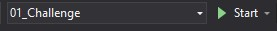
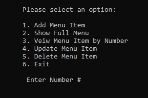
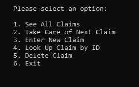
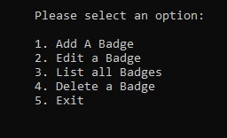

# Gold Badge Console App Challenges

A collection of console apps that utilize Lists, Queues, and Dictionaries in C# in order to display an understanding of how these elements work and my understanding of them. 

## Technologies used
*  Visual Studio 2019 Community
*  C#
*  Git Hub

## Installation

Click on the green code button    at the top right and select clone or download the zip file.   Although there are ways to run this project directly in the command prompt (cmd.exe), or other software, 
it is easiest to use Visual Studio 2019 Community.  Download VS free [@here](https://visualstudio.microsoft.com/downloads/) 

## Console Apps
This is a solution that inclues 3 different console apps and test methods. 
Once you have Visual studio installed you can open the solution to see the different apps and how they were created.
At the top of Visual studio you can choose between the 3 Challenges  and hit Start    to see and use the different Apps.

## Sample Views

Challenge 1 uses a List to hold data for building and updateing a menu.
 

 
 
Challenge 2 uses a Queue for insurance claims. It allows the user to access whatever claim was put in first.
 

 
 
Challenge 3 uses a dictionary and Key Value Pairs in order to take a Badge and grant access to certain doors.
 

 
 

## Contributing
To contribute to this project, follow the instructions for cloning, then commit your code or changes on a new branch.  Please be sure to include unit test before making a pull request.

## Resources
Special thanks the instructors at Eleven Fifty who helped walk me through issues when they arrived and helped me understand how to utilize C#.

## Contact
Please reach out with any questions or suggestions.  <notrealinbox@gmail.com>

## License
[MIT](https://choosealicense.com/licenses/mit/)
